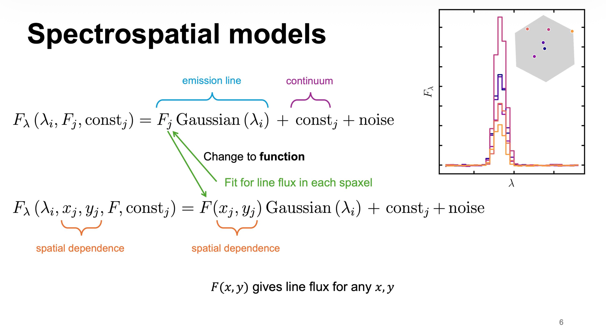

#### Links

- [Slides (PDF)](slides.pdf)
- [Recording](https://youtu.be/KjDQWlm4FiM?si=vhQvRl7uwqW2SMqd)
- [Conference website](https://asa.astronomy.org.au/events/asa-asm/)

---

#### Abstract

The SDSS-V Local Volume Mapper (LVM) survey is delivering unprecedented spectroscopic information about our galaxy, enabling detailed studies of star formation and galaxy evolution across a wide range of spatial scales. LVM is uniquely positioned to map energy and momentum transport, chemical abundances, and the thermal structure of the interstellar medium, down to 0.05 parsecs. Weak emission lines, particularly recombination lines, are essential for robust measurements and for resolving the longstanding "abundance discrepancy problem": the systematic disagreement between methods. But the low signal-to-noise of recombination lines, combined with the sheer scale of LVM's ~55 million spectra, makes reliable measurements challenging. To tackle this, we developed a spatially coherent model that infers emission line properties continuously across the sky, fitting hundreds of thousands of spectra at once. It exploits the fact that nearby spectra tend to be similar, making it especially effective for recovering weak recombination lines. We demonstrate the power of this approach through its first application to the LVM Rosette Nebula dataset, recovering spatially resolved maps of faint line emission. This work also led to the development of a state-of-the-art Gaussian Process framework for scalable inference in multi-dimensional problems.

---

#### Key Slide

