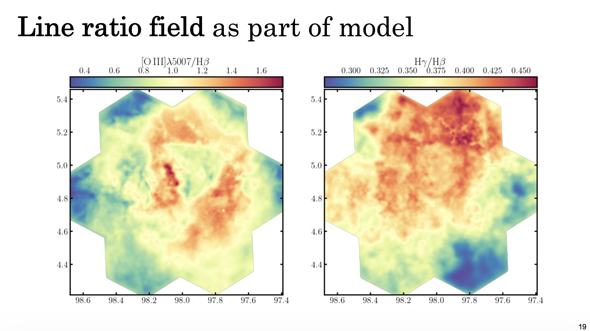

#### Links

- [Slides (PDF)](slides.pdf)
- [Recording](https://youtu.be/3wdIX1v9yDU?si=-4g3LM1ZT98hno68)
- [Conference website](https://fys.kuleuven.be/ster/events/conferences/2026/sdss-v-collaboration-meeting-2026/sdss-v-collaboration-meeting-2026)

---

#### Abstract

The SDSS-V LVM survey is delivering an unprecedented spectroscopic view of the ISM, resolving the ionised gas of the Milky Way spatially across many contiguous pointings. However, this spatial information is left unexploited by per-spaxel fitting, and is destroyed by binning. Faint auroral and metal recombination lines, central to measurements of gas conditions, stellar feedback, and the abundance discrepancy, are also where per-spaxel signal-to-noise is lowest, and so stand to gain the most from a spatially informed approach. In this talk I will present progress on a general probabilistic framework that forward-models IFU data jointly across pointings to infer the underlying fields that generated it, as part of a unified "spectrospatial" approach. This not only helps to enable weak-line science, but it also sharpens strong-line measurements, allows for spatially coherent kinematic decompositions of partially blended line-of-sight components, and lets us infer and marginalise residual calibration and reduction errors.

---

#### Key Slide

